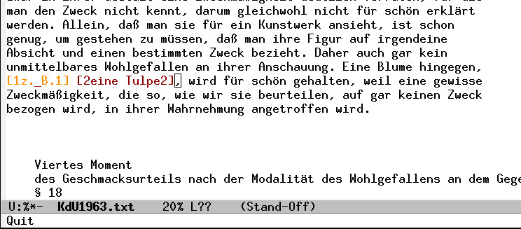
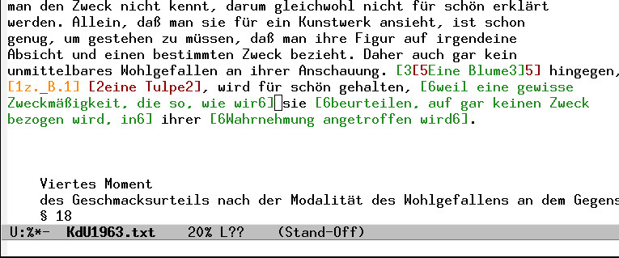
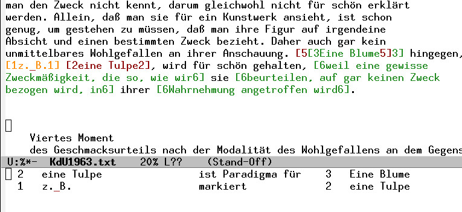
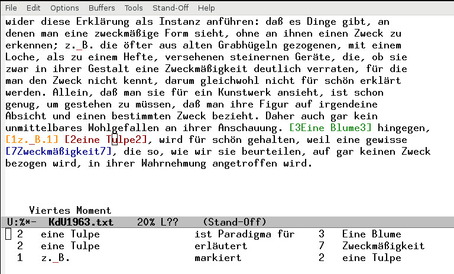

```{r setup, echo = FALSE, message = FALSE, warning = FALSE}
opts_knit$set(root.dir = "~/Projekte/Beispielkorpus/")
library(beispielr)
library(ggplot2)
library(reshape2)
```

# Spekulation über Standardabkürzungen


## Beispiel-Marker

- stark konventionalisierte Abkürzungen zum Markieren von Beispielen,
  dt. *z.B.*, fr. *par ex.*, it. *p.e.*, engl. *e.g.*
- gehen auf das *e.g.* des gelehrten Lateins zurück
- nur wenige Standardabkürzungen mit einem solchen Grad der
  interlingualen Konventionalisierung (*i.e.*, *etc.*, *cf.*)
- *e.g.*: *exempli gratia* (abl. mod.), wörtlich *um eines Beispiels
  willen* oder *aus Gunst des Beispiels*
- Ort des Beispiel-Wissens: Antike Rhetorik und Philosophie


## Dt. *z.B.* im zeitlichen Verlauf

](images/zB-ngram.jpg)


## Lat. *i.e.* und *e.g.*

- die Wendung *exempli gratia* findet sich im antiken Latein
- die Abkürzung *e.g.* hingegen nicht
- erst im 17. Jh. [so jedenfalls nach @Cappelli1990a]
- ebenso *id est* im antiken Latein, aber nicht *i.e.*
- *i.e.* belegbar in Glossen ab dem 9. Jh.
- Grund? Scriptura continua?


## Spekulation

- *i.e.* in Kontext-Glossen [@Henkel1997a]
- *e.g.* nach dem Vorbild von *i.e.* konventionalisiert
- gleiche Funktion: Klarheit
- gleiche Funktion: erlegt dem Leser eine Auseinandersetzung auf, *per
  aspera ad astra* (cf. McCarty)
- I.A. gibt es jeweils eine offene Reihe von Beispielen.
- Probe aufs Verstehen: Man sollte ein weiteres Beispiel hinzufügen
  können.


# Ein DFG-Projekt zum Beispiel

## Das Beispiel im Wissen der Ästhetik …

- DFG-Projekt *Das Beispiel im Wissen der Ästhetik
  (1750-1850). Erforschung und Archivierung einer diskursiven Praxis*

- wissenschaftliche Diskurse sind auf Beispiele angewiesen
- Beispielen kommt bei der Formierung von Wissen eine wichtige Rolle
  zu
- ihr Status für den Erkenntnisgewinn bleibt allerdings meist
  ungeklärt
- in der Ästhetik ist die diskursive Praxis des Beispielgebens
  besonders gut beobachtbar

## Fragen und Methoden

I.  intensive Lektüren einzelner Textstellen
	- Nicht-Aufgehen eines Beispiels im allgemeinen Begriff
	- Autoren haben sich an einzelnen Beispielen abgearbeitet
	- Herausarbeiten eines sog. Beispielstreits
	- Bezug zu beispieltheoretischen Stellen
II.  datenbasierte historische Längsschnitte
	- Häufigkeit/Frequenz bestimmter Beispiele
	- Auftreten, Konjunktur, Verschwinden
	- Korreliertheit der Frequenz von Beispielen untereinander …
	- … oder mit anderen Diskursen
	- Welche überhaupt?

**Annotationen sind Datengrundlage für 2**


# Ein Vokabular zum Beispiel. Manuelle Annotationen

## Beschreibungsvokabular

- **Marker**
	- *z.B.*, *bspw.*, *zum Beispiel*, *etwa*, *wie* …
	- optional
	- eindeutige vs. nicht-eindeutige
- **Beispiel**
	- was als Beispiel angeführt wird
	- (etwas Konkretes)
	- alles kann zum Beispiel werden
- **Konzept**
	- Begriff, Regel, Grundsatz …
	- (etwas Abstraktes)
	- dasjenige, zu dem das Beispiel angeführt wird 
- **Relationen**
	- verbinden Marker und Beispiel, Beispiel und Konzept
	- haben einen Namen (Prädikatsnamen)
	- sind dreistellig
	- zur Beschreibung der diversen Funktionen
	- rhetorische Dimension, konzeptuelle D., epistemologische D.,
      normative D., mnemotechnische D., institutionelle D.

[@CL2018b; @CL2013b]

## Alles kann zum Beispiel werden

> EIN BEISPIEL (EXEMPLUM) ist die Vorstellung von etwas stärker
> Bestimmtem (repraesentatio magis determinati), die zur Erklärung (ad
> declarandam) einer Vorstellung von weniger Bestimmtem
> (repraesentationem minus determinati) beigebracht
> wird. [@Baumg1983a, § 21.]


## Eine Blume

> Eine Blume hingegen, z.B. eine Tulpe, wird für schön
> gehalten, weil eine gewisse Zweckmäßigkeit, die so, wie wir sie
> beurteilen, auf gar keinen Zweck bezogen wird, in ihrer Wahrnehmung
> angetroffen wird. [@KdU1963, § 17]

\vfill

. . .

> Eine Paradigmatik der Blume lenkt die dritte
> *Kritik*. [@Derrida1992, S.107]


## Eine Blume ...



## Eine Blume ...


## Eine Blume ...



## Eine Blume ...



## Eine Blume ...




## Beschreibungsvokabular

- **Marker** …
- **Beispiel** …
- **Konzept** …
- **Relationen**
- **Thema** (**Kontext**)
	- der thematische oder argumentative Zusammenhang, in dem ein
      Beispiel angeführt wird
	- Zwischenüberschrift, rekurrentes Zeichen, Wortfeld


## Annotieren und Hermeneutik

- Versuch, der philosophischen Aussage gerecht zu werden
- setzt eingehendes Verständnis voraus
- Beispiele können beliebig komplex sein
- entsprechend hoher Verstehens-Aufwand
- Annotationen drücken ein Verhältnis zwischen Leser und Text aus
- und sind auch Kommunikationsmittel, etwas Intersubjektives
- hermeneutischer Aufwand beim Lesen der Annot. erneut nötig


## Annotationen und Hermeneutik

> Kein Kommentar, keine stilkritische Untersuchung eines Gedichts darf
> sich das Ziel setzen, eine **Beschreibung des Gedichts herzustellen,
> die für sich aufzufassen wäre**. Noch deren unkritischster Leser wird
> sie mit dem Gedicht konfrontieren wollen, sie allererst verstehen,
> wenn er die Behauptungen **wieder in die Erkenntnisse aufgelöst hat,
> aus denen sie hervorgegangen sind**. [@Szondi1967a, S.11]

- pragmatischer Aspekt: Der hermeneutische Aufwand, der beim
  Annotieren aufgebracht worden ist, ist beim Lesen von Annotationen
  erneut nötig.
- theoretischer bzw. dogmatischer Aspekt: Annotationen sind *keine
  Daten* in dem Sinne, auf den uns der Wortsinn von lat. *datum*
  führt. Im Aufwand, den es jedes Mal darstellt, Annotationen zu
  lesen, wird ihr Nicht-Datenhaftes erfahrbar.

Aporie: Einerseits wollen wir Daten gewinnen, nämlich für eine
›empirische‹, material- oder daten-gesättigte Analyse (zeitliche
Verläufe). Andererseits macht sich immer wieder bemerkbar, dass es
sich nicht einfach um Daten handelt.

M.E. sollte man derlei Spannungen nicht einfach auflösen.

# Maschinelle Annotation

## Beobachtung: Frequenz und Beispiele

Keine Beispiele unter den Substantiven hoher Häufigkeit (Spalte `n`).

\begingroup
\fontsize{6pt}{8pt}\selectfont

```{r frequenzen1, echo = FALSE}
corpus <- read_csv_corpus("tcf")
freqs <- corpus %>%
    filter(sigle == "KdU1963", POStag == "NN") %>%
    count(sigle, lemma) %>%
    arrange(desc(n))
freqs %>% print(n=20)
```

\endgroup

## Beobachtung: Frequenz und Beispiele

Gelegentlich Beispiele unter den Substantiven mittlerer Häufigkeit.

\begingroup
\fontsize{6pt}{8pt}\selectfont

```{r frequenzen2}
freqs %>% slice(200:250) %>% print(n=20)
```

\endgroup


## Beobachtung: Frequenz und Beispiele

Gelegentlich Beispiele unter den Substantiven geringer Häufigkeit.

\begingroup
\fontsize{6pt}{8pt}\selectfont

```{r frequenzen3}
freqs %>% slice(1000:1050) %>% print(n=20)
```

\endgroup


## Beobachtung: Frequenz und Beispiele

Gelegentlich Beispiele unter den Substantiven geringer Häufigkeit.

\begingroup
\fontsize{6pt}{8pt}\selectfont

```{r frequenzen4}
freqs %>% slice(1960:1980) %>% print(n=20)
```

\endgroup


## Beobachtung: Frequenz und Beispiele

Zumindest bei den Werken unseres Korpus finden sich die Beispiele

- nicht unter den Tokens, deren Zitierform eine hohe Frequenz hat,
- sondern eher im mittleren
- und unteren Frequenzbereich.

Der Grund liegt vermutlich in der Funktion von Beispielen in Bezug auf
die Thema-Rhema-Gliederung [@Bussm1990, S.784-786] von
Texten. (Hypothese)

Herausforderung:

Im unteren und mittleren Frequenzbereich finden sich die Tokens und
Zitierformen von Beispielen alles anderer als dicht nebeneinander,
sondern nach dem Zipfschen Gesetz *verstreut*.

## Zipfsches Gesetz

```{r zipf, echo = FALSE, message = FALSE, fig.cap = "Zipfsches Gesetz"}
corpus %>%
    freq(sigle, token)%>%
    arrange(desc(freq)) %>%
    group_by(sigle) %>%
    mutate(rank = row_number()) %>%
    ggplot(aes(rank, freq, color = sigle)) +
    geom_line(size = 1.1, alpha = 0.8, show.legend = TRUE) +
    scale_x_log10() +
    scale_y_log10()
```

## Substantive (Zitierformen)

```{r zipfnn, echo = FALSE, message = FALSE, fig.cap = "Zipfsches Gesetz gilt näherungsweise auch noch für die größte Teilmenge."}
corpus %>%
    filter(POStag == "NN") %>%
    freq(sigle, lemma)%>%
    arrange(desc(freq)) %>%
    group_by(sigle) %>%
    mutate(rank = row_number()) %>%
    ggplot(aes(rank, freq, color = sigle)) +
    geom_line(size = 1.1, alpha = 0.8, show.legend = TRUE) +
    scale_x_log10() +
    scale_y_log10()
```


## Kopf eines Beispiels

Bei der automatischen Annotation kann (zunächst) nur ein sehr
beschränktes Ziel verfolgt werden:

- Identifizierung eines einzelnen Tokens als `Kopf` eines Beispiels
- Kriterium: Das als `Kopf` identifizierte Token soll in der Menge der
  Tokens enthalten sein, die manuell als `Beispiel` annotiert worden
  wäre.
- der Kopf eines Beispiels nur in Sätzen mit einem eindeutigen Marker

Zur Bestimmung des Kopfes werden folgende Merkmale ausgewertet:

- Frequenz
	- Token-Frequenz (term frequency, `tf`)
	- Lemma-Frequenz (`lf`)
- Distanz vom Marker
	- in Tokens (`dmt`)
	- in Satzzeichen (Kommas, `dmc`)
- Wortart (Part-of-speech-Tags, `pos`)


## Bestimmung des Beispiel-Kopfes

- jedes Merkmal $f_i$ hat Wert zwischen 0 und 1
- jedes Merkmal $f_i$ wird mit einem Gewicht $w_i$ multipliziert
- Bildung der Summe $f_K(t) = \sum_{i=1}^n w_i \cdot f_i(t)$
- Beispiel-Kopf ist dasjenige Token $t$ im Satz des Beispielmarkers, für das
  $f_K$ maximal


## Datengrundlage und Architektur

\begingroup
\fontsize{6pt}{8pt}\selectfont
\input{datengrundlage}
\endgroup


## Eine Blume hingegen, z.B. … -- Datengrundlage

\begingroup
\fontsize{8pt}{9.6pt}\selectfont

```{r corpus}
corpus %>% filter(tokenNum >= 27071)
```

\endgroup

## Eine Blume hingegen, z.B. … -- Kopf-Berechnung

\begingroup
\fontsize{8pt}{9.6pt}\selectfont


```{r satz_tulpe, echo = FALSE, message = FALSE, warning = FALSE}
features <- corpus %>%
    generate_example_features() %>%
    annotate_example_head(weights)
satz_tulpe <- features %>% filter(sentenceNum == 598)
satz_tulpe %>%
    select(tokenNum, token, norm_dmt, norm_dmc, norm_tf, norm_lf, norm_pos, sum, is_head) %>%
    print(n=40)

```

\endgroup

## Eine Blume hingegen, z.B. … -- Erklärungskomponente

```{r explain, echo = FALSE, message = FALSE, warning = FALSE, fig.cap = "Anteile der gewichteten Merkmale an $f_K$"}
features_in_order <- c("w_lf", "w_tf", "w_pos", "w_dmt", "w_dmc")
satz_tulpe2 <- as_tibble(melt(satz_tulpe,
                              id.vars="tokenNum",
                              measure.vars=features_in_order))
satz_tulpe3 <- satz_tulpe2 %>% arrange(tokenNum, factor(.$variable, levels=features_in_order))
ggplot(satz_tulpe3) +
    geom_area(mapping = aes(x=tokenNum, y=value, color=variable, fill=variable))

```

## Fazit I: Forderung nach Nachvollziehbarkeit

- Die Ergebnisse maschineller Annotationen sollten nachvollziehbar
  sein.
- D.h. ein maschinelles Verfahren bzw. Algorithmus sollte eine
  *Erklärungskomponente* haben [@Beierle2014a, S.18].
- Hier basiert es auf gegebenen Merkmalen, deren Zustandekommen wieder
  leicht nachvollziehbar ist
  [zu Einschränkungen vgl. @Zinsmeister2015a].
- Das Nachvollziehen einer maschinellen Annotation hat (hier) eine
  andere epistemische Struktur als das einer manuellen.
- klassischer Unterschied zwischen Erklären/Erkennen und Verstehen
  [@Dilthey1927a, S.79--88]? Sinnvolle Unterscheidung?


## Beispiel-Köpfe aus der *Kritik der Urteilskraft*

\begingroup
\fontsize{8pt}{9.6pt}\selectfont

```{r examples, echo  = FALSE, message = FALSE, warning = FALSE}

examples <- features %>%
    filter(is_head == TRUE) %>%
    select(sigle, sentenceNum, token)
examples %>% print(n = 30)


```

\endgroup


## Serialisierung der Kopf-Annotationen

\begingroup
\fontsize{8pt}{9.6pt}\selectfont

```{r sentences, echo = FALSE, message = FALSE, warning = FALSE}
sentences <- features %>%
    mutate(read_token = if_else(is_head, paste0("<h>", token, "</h>"), token)) %>%
    group_by(sigle, sentenceNum) %>%
    summarize(reads = paste(read_token, collapse = " ")) %>%
    ungroup()

sentences %>%
    filter(sigle == "KdU1963") %>%
    filter(sentenceNum %in% c(269, 497, 523, 569, 598, 637, 1174, 1209, 1501, 1512, 1544)) %>%
    select(reads) %>% print(n=30)

```

\endgroup

## Fazit II: Fehlerquote

- Das Verfahren identifiziert nicht mehr als 90% der Beispielköpfe in
  der *Kritik der Urteilskraft* in Sätzen mit dem eindeutigem
  Beispielmarker *z.B.* richtig.
- mindestens jeder 10te Kopf wird nicht richtig identifiziert
- relativ hohe Fehlerquote
- Verbesserungspotential:
	- Merkmalskombinationen
	- nicht nur isolierte Tokens, sondern auch Kontext auswerten,
      z.B. POS-Tag-Muster
	- ggf. Auswerten der Konstituenten-Struktur (aufgrund der
      Fehlerbehaftung kommt ein Constituent-Parser nicht zentral zur
      Anwendung)


## Literatur
\fontsize{5pt}{6}\selectfont
